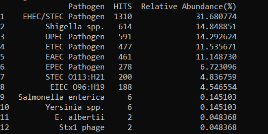

# SIDANPD(Under Development)
SIDANPD is an automated pipeline for detecting gut pathogen using sequence from ONT-Nanopore Sequencing(FASTQ)

Prerequisites:

BLAST+:

`sudo apt-get update`
`sudo apt-get install ncbi-blast+-legacy`

seqtk:

`sudo apt-get install seqtk`

porechop:

`sudo apt-get install porechop`

seqkit:

https://github.com/shenwei356/seqkit/releases

`sudo cp seqkit /usr/local/bin/`

Python dependencies:

`pip3 install pandas`
`pip3 install biopython`

# Usage

Download the database(https://drive.google.com/drive/folders/1RDWMOacKUAe29VoccGpOL7uASiMg264f?usp=sharing) files and put in the database folder.
Rename the fastq sequence to "test.fastq"

Run the following command:

`bash automate.sh`

# Results

